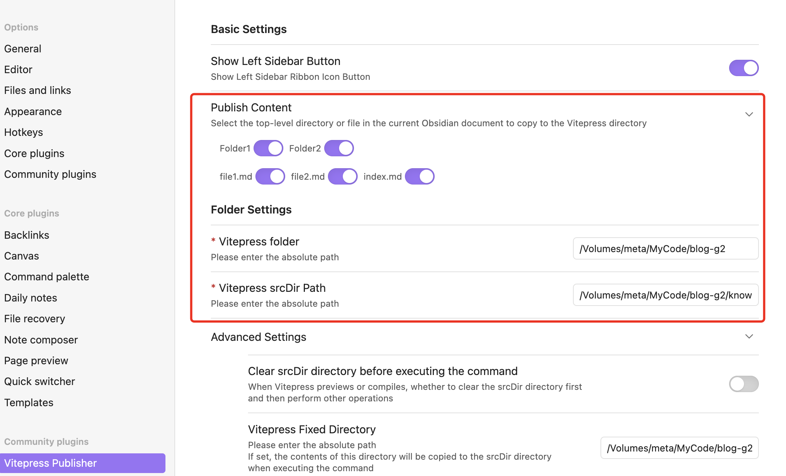
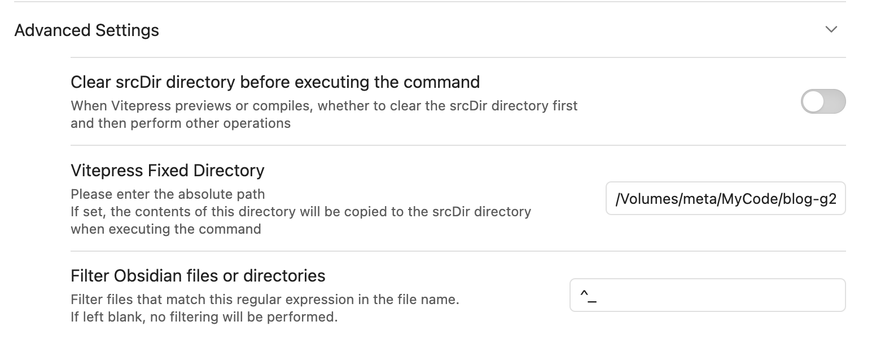
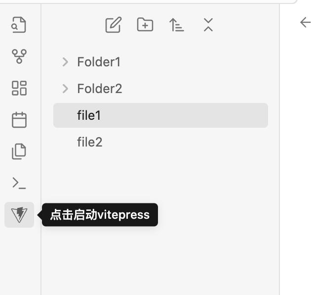
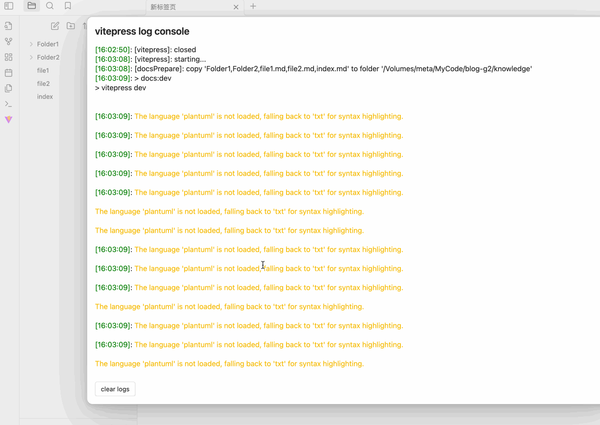
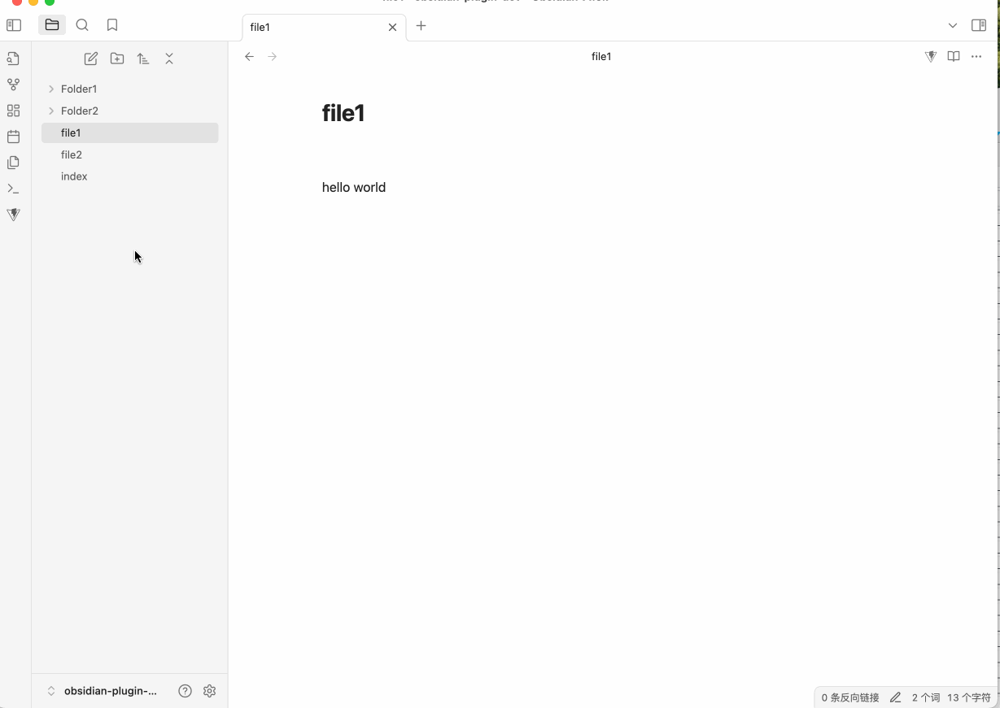
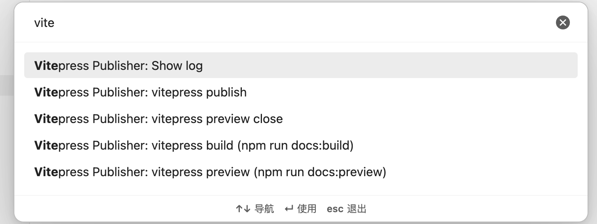

# Obsidian Vitepress Plugin   [中文文档](./README_zh.md)

Obsidian Vitepress Plugin is a flexible tool that allows you to easily preview and compile your .md files using VitePress or other static site generators (Hugo, Hexo, Docusaurus) in Obsidian.

## Installation

### Community Plugin Store

This Plugin can be installed through the community plugin browser in Obsidian.

### Manual Installation

Download `main.js`, `manifest.json`, and `styles.css` from the [release](https://github.com/tyrad/obsidian-vitepress/releases) page and place them in `<vault>/.obsidian/plugins/obsidian-vitepress` directory.

## Configuration

### Required Settings

- `Publish Content`: Select the top level directories or files to be previewed or published using VitePress
- `Directory Settings`:
	- `VitePress Path`: Path to VitePress on your local machine
	- `VitePress srcDir Path`: Location of VitePress [src directory](https://vitepress.dev/reference/site-config#srcdir)

### Advanced Settings

### Custom Command Configuration

The plugin now supports configurable commands, allowing you to use other static site generators beyond VitePress:

- **Development Command**: Command to start local preview server (default: `npm run docs:dev`)
- **Build Command**: Command to generate static files (default: `npm run docs:build`)
- **Preview Command**: Command to preview built site (default: `npm run docs:preview`)

**Supported Static Site Generators**:
- **Hugo**: `/opt/homebrew/bin/hugo serve`
- **Hexo**: `npx hexo server`
- **Docusaurus**: `npm start`
- **Custom**: Any command-line static site generator

This flexibility allows you to use the plugin with your preferred static site generator while maintaining the same workflow.

## Usage

### Sidebar Button

Click to start or stop `vitepress dev` and open the VitePress homepage in your browser.

### Top Bar Button

Click to copy the current document to the VitePress srcDir directory and preview it.

### Commands

Commands are now customizable through the Custom Command Configuration settings.

- `Show log`: Open the log window for this plugin
- `vitepress build`: Execute the build command `npm run docs:build` in the VitePress directory
- `vitepress preview`: Execute the preview command `npm run docs:preview` in the VitePress directory
- `vitepress preview close`: Close VitePress preview
- `vitepress publish`: Open a new terminal window and run the publish script specified in the settings

## Support

If you find this plugin helpful, please consider giving it a ⭐ on GitHub! Your support helps improve the plugin and lets others discover it.

# License

MIT
