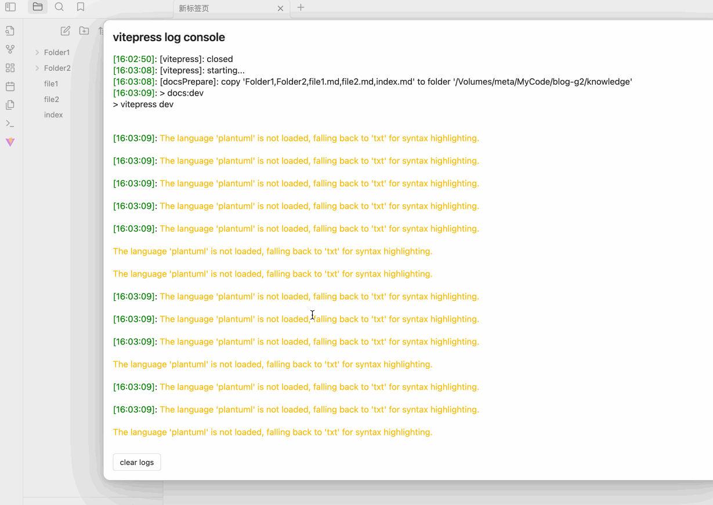
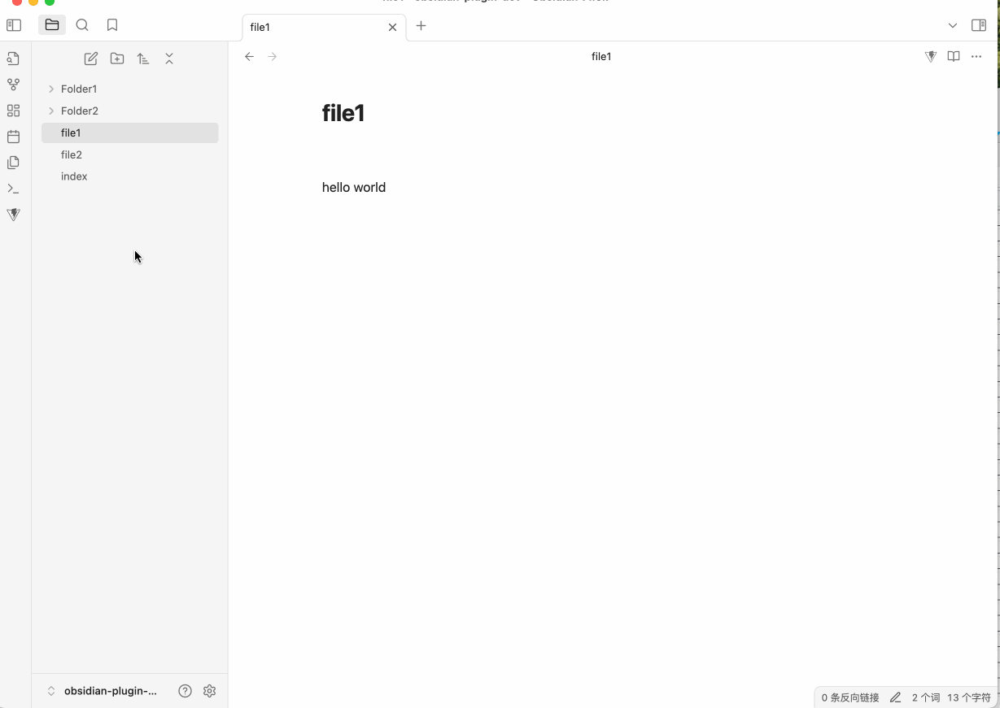
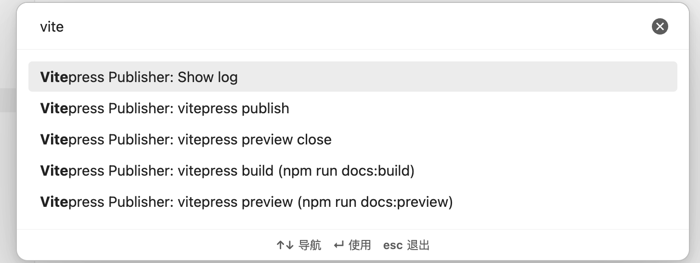

# Obsidian Vitepress Plugin   [中文文档](./README_zh.md)

Obsidian Vitepress Plugin is a tool that allows you to easily preview and compile your .md files using Vitepress in Obsidian.

## Installation

### Manual Installation

Download `main.js`, `manifest.json`, and `styles.css` from the [release](https://github.com/tyrad/obsidian-vitepress-plugin/releases) page and place them in `<vault>/.obsidian/plugins/obsidian-vitepress-plugin` directory.

## Configuration

### Required Settings

- `Publish Content`: Select the top level directories or files to be previewed or published using Vitepress
- `Directory Settings`:
	- `Vitepress Path`: Path to Vitepress on your local machine
	- `Vitepress srcDir Path`: Location of Vitepress [src directory](https://vitepress.dev/reference/site-config#srcdir)

### Advanced Settings

## Usage

### Sidebar Button

Click to start or stop `vitepress dev` and open the Vitepress homepage in your browser.

### Top Bar Button

Click to copy the current document to the Vitepress srcDir directory and preview it.

### Commands

- `Show log`: Open the log window for this plugin
- `vitepress build`: Execute the default build command `npm run docs:build` in the Vitepress directory
- `vitepress preview`: Execute the default preview command `npm run docs:preview` in the Vitepress directory
- `vitepress preview close`: Close Vitepress preview
- `vitepress publish`: Open a new terminal window and run the publish script specified in the settings

# License

MIT
