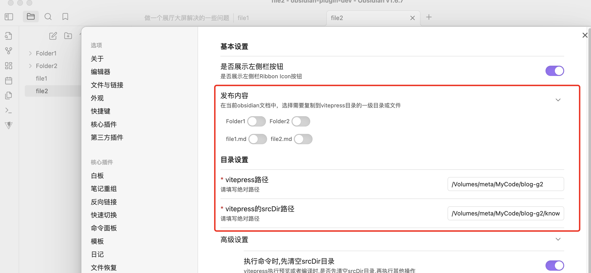
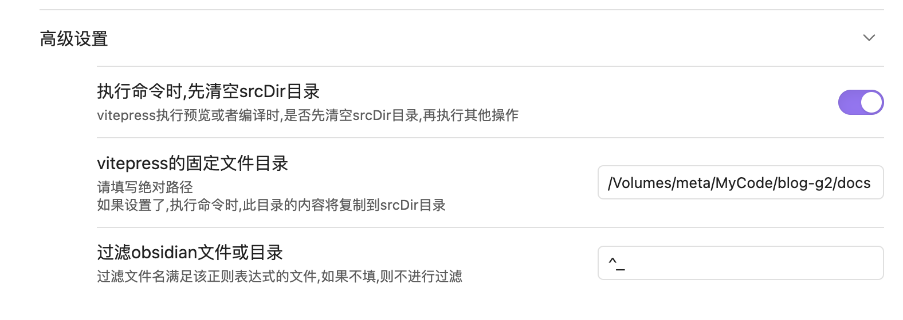
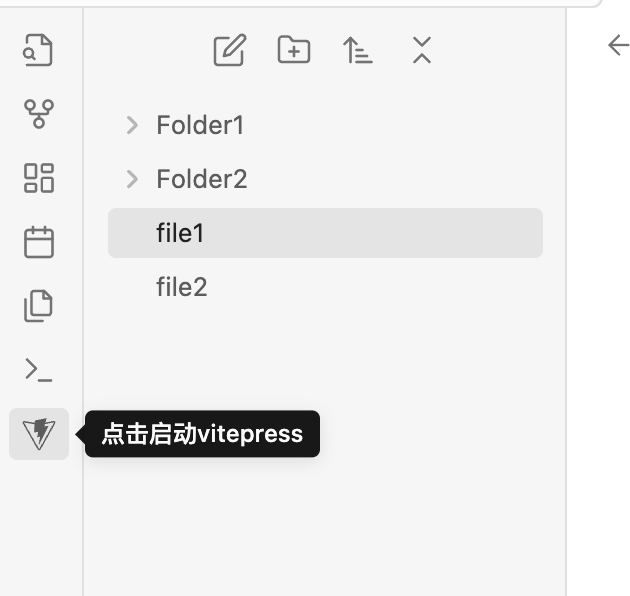
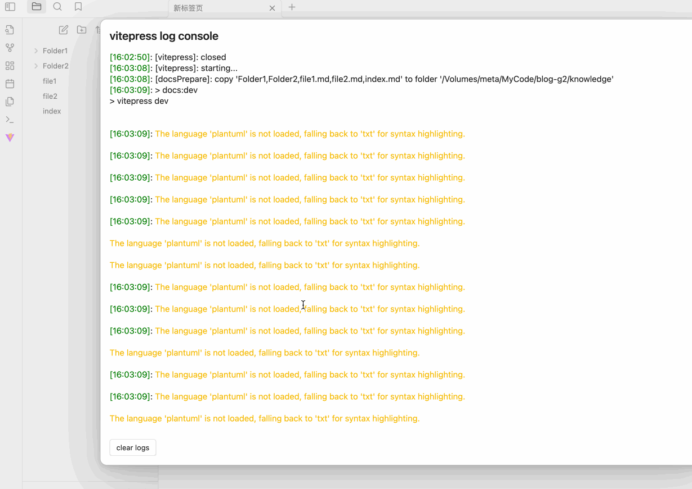
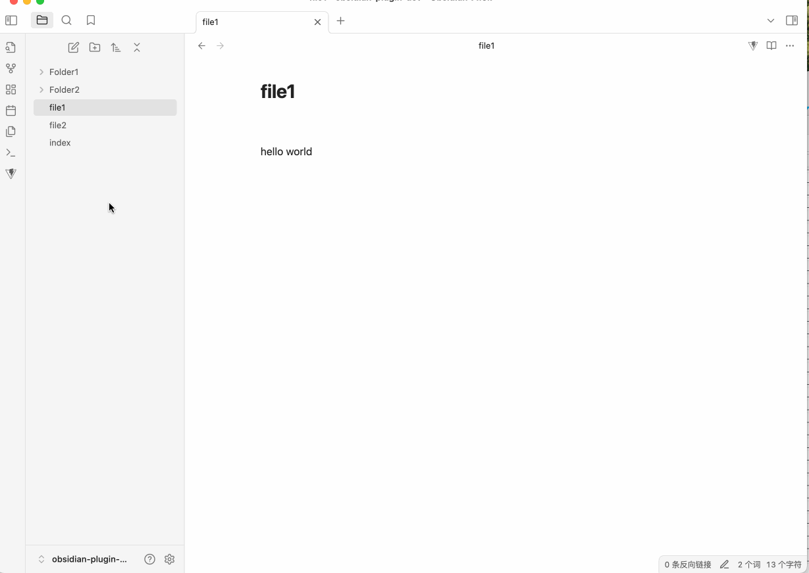
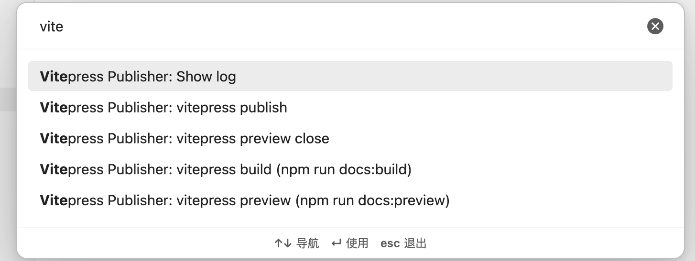

# Obsidian Vitepress Plugin  [英文文档](./README.md)

本插件用于在obsidian中，方便快捷地调用vitepress预览.md文件或者编译发布到你的个人网站。

## 如何安装

### 手动安装

从 [release](https://github.com/tyrad/obsidian-vitepress-plugin/releases) 页面下载 `main.js`, `manifest.json`, `styles.css` ，并将其放到 `<vault>/.obsidian/plugins/obsidian-vitepress-plugin` 目录下。

## 如何配置

### 必要的设置

如图所示：
- `发布内容`：需要选中哪些一级目录或文件需要使用vitepress预览发布
- `目录设置`：
	- `vitepress路径`：本机vitepress目录位置
	- `vitepress的srcDir路径` vitepress [src目录](https://vitepress.dev/reference/site-config#srcdir)位置

### 高级设置

## 使用说明

### 侧栏按钮

点击将启动或者停止`vitepress dev`，并在浏览器打开vitepress的主页。

### 文档顶部按钮

点击时，会将当前文档复制到vitepress srcDir目录,并进行预览。

### 命令

- `Show log`: 打开本插件的日志弹窗
- `vitepress build`: 将在vitepress目录下执行默认build命令 `npm run docs:build`
- `vitepress preview`: 将在vitepress目录下执行默认build命令 `npm run docs:preview`
- `vitepress preview close`: 关闭 vitepress preview
- `vitepress publish`: 将打开新的终端窗口，执行设置里的发布脚本

# License

MIT
