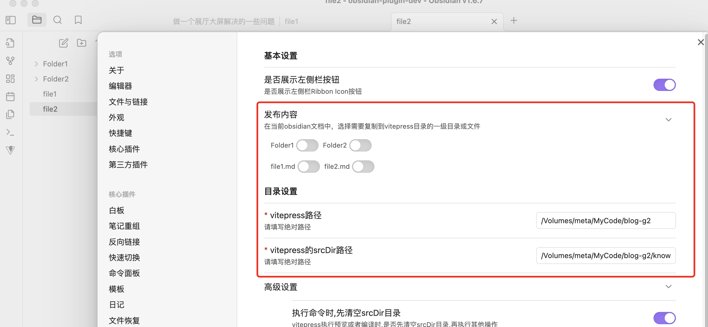
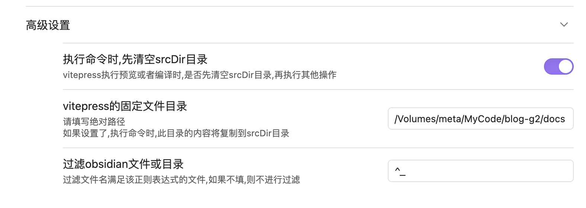

# Obsidian Vitepress Plugin  [英文文档](./README.md)

本插件是一个灵活的工具，用于在 Obsidian 中方便快捷地调用 VitePress 或其他静态站点生成器（Hugo、Hexo、Docusaurus）预览 .md 文件或编译发布到你的个人网站。

## 如何安装

### 从社区商店安装

Obsidian Vitepress Plugin 支持从社区插件商店下载。

### 手动安装

从 [release](https://github.com/tyrad/obsidian-vitepress/releases) 页面下载 `main.js`, `manifest.json`, `styles.css` ，并将其放到 `<vault>/.obsidian/plugins/obsidian-vitepress` 目录下。

## 如何配置

### 必要的设置

如图所示：
- `发布内容`：选择哪些一级目录或文件需要使用 VitePress 预览发布
- `目录设置`：
	- `VitePress 路径`：本机 VitePress 目录位置
	- `VitePress 的 srcDir 路径`：VitePress [src目录](https://vitepress.dev/reference/site-config#srcdir)位置

### 高级设置

### 自定义命令配置

插件现在支持可配置命令，允许您使用 VitePress 以外的其他静态站点生成器：

- **开发命令**：启动本地预览服务器的命令（默认：`npm run docs:dev`）
- **构建命令**：生成静态文件的命令（默认：`npm run docs:build`）
- **预览命令**：预览构建站点的命令（默认：`npm run docs:preview`）

**支持的静态站点生成器**：
- **Hugo**：`/opt/homebrew/bin/hugo serve`
- **Hexo**：`npx hexo server`
- **Docusaurus**：`npm start`
- **自定义**：任何命令行静态站点生成器

这种灵活性使您能够使用首选的静态站点生成器，同时保持相同的工作流程。

## 使用说明

### 侧栏按钮

点击可启动或停止 `vitepress dev`，并在浏览器打开 VitePress 的主页。

### 文档顶部按钮

点击可将当前文档复制到 VitePress srcDir 目录，并进行预览。

### 命令

命令现在可以通过自定义命令配置进行自定义。

- `Show log`: 打开本插件的日志弹窗
- `vitepress build`: 将在 VitePress 目录下执行构建命令 `npm run docs:build`
- `vitepress preview`: 将在 VitePress 目录下执行预览命令 `npm run docs:preview`
- `vitepress preview close`: 关闭 VitePress 预览
- `vitepress publish`: 将打开新的终端窗口，执行设置里的发布脚本

## 支持

如果这个插件对您有帮助，请考虑在 GitHub 上给它一个 ⭐！您的支持有助于改进插件，也能让更多人发现它。

# License

MIT
